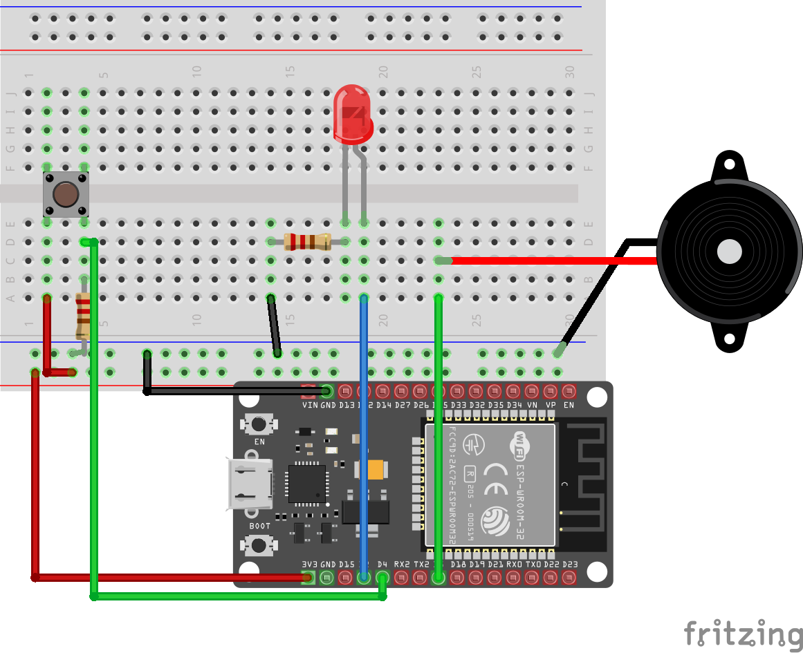

**RaddedMC's SmartButton**
This project is currently a work-in-progress. Most things work but there are a few small things to be ironed out...
Requirements:
 - An ESP32 or ESP8266 Microcontroller
 - An internet connection / WiFi router
 - Some webhooks!
 - Some kind of button / switch to wire to the ESP32
 - Also helpful to have an LED and/or passive piezo
 
Instructions:
 - Build the below circuit:
 
   - If you're using an ESP8266 NodeMCU, substitute D2, D4, and D6 with the pins labelled D4, D2, and D1 respectively. The resistors I used are 1kOhm.
 - Clone the EasyButton.ino file that matches your board
 - Make sure your Arduino IDE is set up for an ESP32 or ESP8266 NodeMCU board
 - Set Wifi SSID and password, and set up webhooks of your choosing (make sure that you use http:// in your URL as opposed to https://. 
 - You can change pins to whatever you like. Helpful if you don't want the ESP's built-in LED to blink when you do things or if you want to use one of the touch sensor pins instead of a boring clicky button.
 
**As mentioned, this project is a work in progress. Suggestions are appreciated, and these instructions are guaranteed to change over time.**

Feel free to dm me on Insta @RaddedMC or Discord at RaddedMC#4791 for any questions. Video for this project is in the works!
